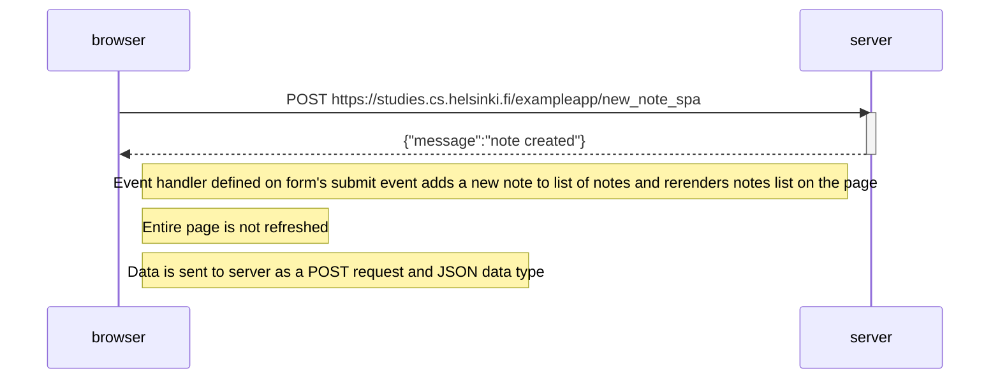

```mermaid
sequenceDiagram
    participant browser
    participant server

    browser->>server: POST https://studies.cs.helsinki.fi/exampleapp/new_note_spa
    activate server
    server-->>browser: {"message":"note created"}
    deactivate server

    Note right of browser: Event handler defined on form's submit event adds a new note to list of notes and rerenders notes list on the page

    Note right of browser: Entire page is not refreshed    

    Note right of browser: Data is sent to server as a POST request and JSON data type
```